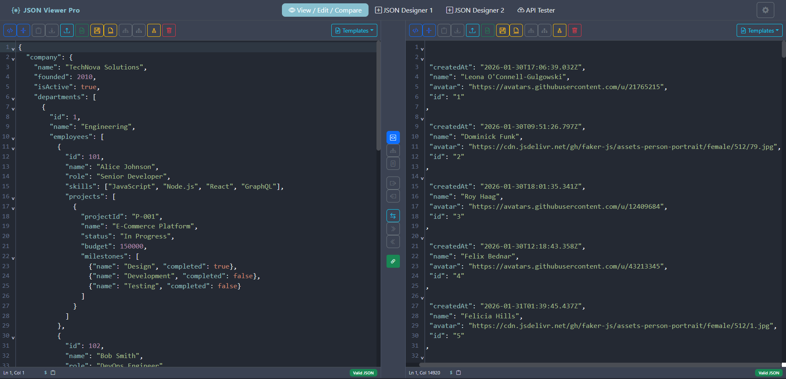
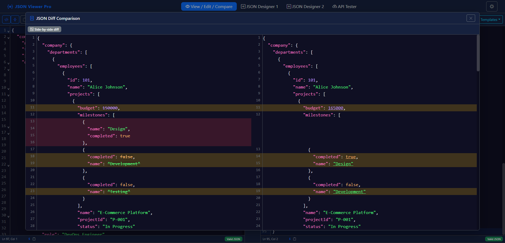
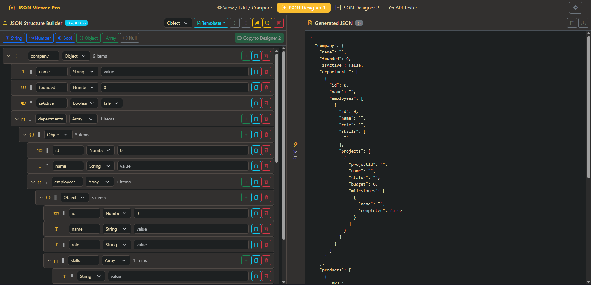
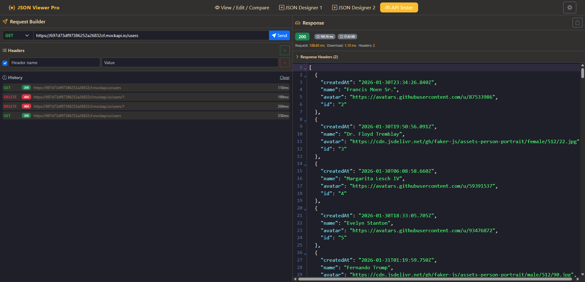

# JSON Viewer Pro

A feature-rich JSON viewer, editor, and comparison tool built with React and Express.

[](https://nodejs.org/)
[](https://reactjs.org/)
[](LICENSE)

## Why Another JSON Viewer?

Most JSON viewers are either:
- **Too simple** - Just pretty-print and basic tree view
- **Online only** - Require uploading sensitive data to third-party servers
- **Single purpose** - View OR edit OR compare, but not all three

**JSON Viewer Pro** is different:

- **All-in-one tool** - View, edit, compare, visualize, and build JSON in one application
- **Privacy-first** - Runs locally, your data never leaves your machine
- **Developer-focused** - Built-in API tester, template system, and JSON path navigation
- **Dual-panel architecture** - Side-by-side editing with sync scroll and diff comparison
- **Visual builder** - Create JSON structures with drag-and-drop, no typing required
- **Fully themeable** - 13 built-in themes for comfortable extended use

## Features

### Core Features
- **Dual-panel editor** with synchronized scrolling
- **Real-time JSON validation** with error highlighting
- **Format/Minify** with configurable indentation (2, 3, or 4 spaces)
- **JSON Path display** - Shows path at cursor (e.g., `$.users[0].name`) with copy button

### View Modes
- **Code View** - Syntax-highlighted editor with line numbers and code folding
- **Tree View** - Collapsible hierarchical view with search functionality
- **Diff View** - Side-by-side comparison with change highlighting
- **Graph View** - JSON Crack-style tree visualization with color-coded nodes and smooth connectors

### JSON Designer
- **Visual JSON builder** - Create structures without writing code
- **Drag and drop** - Reorder nodes intuitively
- **Type selector** - String, Number, Boolean, Null, Object, Array
- **Dual designers** - Two independent workspaces with cross-copy support

### Template System
- **Save templates** - Store frequently used JSON structures
- **Built-in templates** - package.json, Config File, API Response
- **Server storage** - Templates persist in local `templates/` folder

### API Tester
- **HTTP client** - GET, POST, PUT, PATCH, DELETE methods
- **Headers management** - Add, remove, and toggle custom headers
- **Request body editor** - With content-type selector
- **Performance metrics** - Total time, fetch time, download time, response size
- **Request history** - Quick access to previous requests

### Theming
13 built-in themes including:
- Light, Dark, Midnight Blue, Forest, Sunset, Ocean
- Nord, Solarized Light, High Contrast
- Dracula, Monokai, Gruvbox, Tokyo Night

## Installation

### Requirements
- **Node.js** 18.x or higher
- **npm** 9.x or higher

### Quick Start

```bash
# Clone the repository
git clone https://github.com/yourusername/json-viewer-pro.git
cd json-viewer-pro

# Install dependencies
npm install

# Start development server
npm run dev
```

The application will open at `http://localhost:5173`

### Available Scripts

| Command | Description |
|---------|-------------|
| `npm run dev` | Start both backend and frontend servers |
| `npm run server` | Start only the Express backend (port 3001) |
| `npm run client` | Start only the Vite frontend (port 5173) |
| `npm run build` | Build for production |
| `npm run preview` | Preview production build |

## Tech Stack

| Technology | Purpose |
|------------|---------|
| [React 18](https://reactjs.org/) | UI framework |
| [Vite](https://vitejs.dev/) | Build tool & dev server |
| [Express.js](https://expressjs.com/) | Backend API server |
| [Bootstrap 5](https://getbootstrap.com/) | CSS framework |
| [CodeMirror 6](https://codemirror.net/) | Code editor |
| [D3.js](https://d3js.org/) | Graph visualization |
| [react-arborist](https://github.com/brimdata/react-arborist) | Tree drag-and-drop |

## Project Structure

```
json-viewer-pro/
├── server/                    # Express backend
│   ├── index.js              # Server entry point
│   └── routes/
│       └── templates.js      # Template API routes
├── templates/                 # Saved JSON templates
├── src/
│   ├── App.jsx               # Main application
│   ├── components/
│   │   ├── ViewEditCompare.jsx   # Dual-panel editor
│   │   ├── JsonCreator.jsx       # Visual JSON builder
│   │   ├── ApiTester.jsx         # HTTP client
│   │   ├── TemplateModal.jsx     # Template save/load
│   │   └── ...
│   ├── services/
│   │   └── templateApi.js    # Template API client
│   └── context/
│       └── ThemeContext.jsx  # Theme management
├── package.json
└── vite.config.js
```

## API Endpoints

The Express backend provides a REST API for template management:

| Method | Endpoint | Description |
|--------|----------|-------------|
| GET | `/api/templates` | List all templates |
| GET | `/api/templates/:name` | Get a template by name |
| POST | `/api/templates` | Create a new template |
| PUT | `/api/templates/:name` | Update a template |
| DELETE | `/api/templates/:name` | Delete a template |

## Usage

### Basic Editing
1. Paste or type JSON in either panel
2. Use **Format** to pretty-print or **Minify** to compress
3. Toggle between **Code View** and **Tree View**


### Comparing JSON
1. Load JSON in both left and right panels
2. Click the **Diff** button in the center controls
3. View side-by-side comparison with highlighted changes



### Building JSON
1. Navigate to **JSON Designer** tab
2. Add nodes using the type buttons (String, Number, Object, etc.)
3. Drag nodes to reorder
4. Copy generated JSON from the right panel



### Simple API Testing
1. Navigate to **API Tester** tab
2. Enter the API URL and select HTTP method
3. Add headers and request body as needed
4. Click **Send** and view response with performance metrics



## Browser Support

- Chrome (latest)
- Firefox (latest)
- Edge (latest)
- Safari (latest)

## Contributing

Contributions are welcome! Please feel free to submit a Pull Request.

1. Fork the repository
2. Create your feature branch (`git checkout -b feature/AmazingFeature`)
3. Commit your changes (`git commit -m 'Add some AmazingFeature'`)
4. Push to the branch (`git push origin feature/AmazingFeature`)
5. Open a Pull Request

## License

This project is licensed under the MIT License - see the [LICENSE](LICENSE) file for details.

## Acknowledgments

- [CodeMirror](https://codemirror.net/) for the excellent code editor
- [D3.js](https://d3js.org/) for powerful data visualization
- [Bootstrap](https://getbootstrap.com/) for the UI framework
- [react-arborist](https://github.com/brimdata/react-arborist) for tree components

---

Made with React and Express.js

